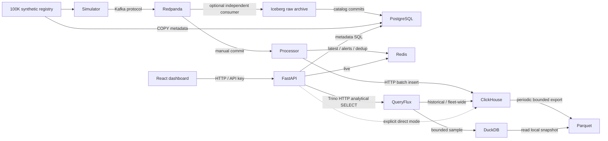

# ValeoSense

**Real-time intelligence for massive connected-vehicle streams.**

A working hackathon streaming platform: 100,000 deterministic synthetic vehicles, stateful Kafka telemetry, Redis live state, ClickHouse history, PostgreSQL metadata, a FastAPI API, and a React dashboard. The existing **QueryFlux** project routes analytical SQL to ClickHouse and embedded DuckDB; it is an external dependency, not software rebuilt for this submission.

## Problem

Continuous connected-vehicle writes and large historical scans have different access patterns. Putting both behind one relational workload increases contention and write/index costs. The hackathon asks us to demonstrate a practical alternative at a 100K-vehicle registry scale. We do not claim that this laptop sustained 100K events/sec or that a relational database is always unsuitable.

## Solution

A single bounded simulator publishes stateful readings to Redpanda. A Python consumer validates, deduplicates, detects events, writes history in batches, and updates latest state. Fleet managers can see moving/idling vehicles, speeding/braking/fault incidents, assumed idling waste, and historical analytics. Redis requests remain independent of the analytical query admission queue.

## Architecture



[Run the demo](RUN_PROJECT.md) · [Submission checklist](docs/submission-checklist.md) · [Detailed architecture](docs/architecture.md) · [ER diagram](docs/er-diagram.mmd) · [ADRs](docs/adr) · [Solution document](docs/solution-document.md)

## Why not one database?

PostgreSQL enforces metadata relationships without raw event writes. Redis serves small live-state reads. ClickHouse batches append-oriented history and prunes historical lookups by vehicle/time. DuckDB serves small selections from a bounded local Parquet snapshot through QueryFlux. Redis/PostgreSQL are persistence services, while ClickHouse and DuckDB are the analytical execution engines. Kafka absorbs temporary producer/consumer mismatches. This improves separation of concerns, while adding operational and cross-sink consistency costs that the documentation explicitly acknowledges.

## Technology stack

Python 3.11+, FastAPI, Pydantic, confluent-kafka, Redpanda, Redis, PostgreSQL, ClickHouse, existing QueryFlux, embedded DuckDB, React, Vite, Docker Compose, pytest, Ruff, and Playwright/Chromium. Python and frontend dependencies are locked. Major dependency license declarations are in [open-source.md](docs/open-source.md).

## Quick start

Prerequisites: Python 3.11+, Node 22+, Docker with Compose 2.24+, and enough free RAM/disk for local services. Initial setup downloads dependencies and images.

```bash
make setup                 # creates .env once with random local credentials
docker compose up --build -d  # both analytical engines, metadata seed and simulator
make verify-dual-engine       # real queries and native engine-counter checks
```

Open **http://localhost:3000**. Enter the `API_KEY` from your local `.env`; do not expose it in recordings. The backend is at http://localhost:8000 and interactive API schema at http://localhost:8000/docs. Published core service ports are bound to loopback. API key authentication protects `/api/v1/*`.

If the dashboard cannot fetch data, check `docker compose --env-file .env -f infra/docker-compose.yml ps -a`
and `curl http://localhost:8000/health`. Stopped services need `make up` (or
`make demo-queryflux` if using the QueryFlux route). An invalid key can be replaced
with **Update API key** in the dashboard. Failed panels clear their old values and
retry independently; **Retry now** retries immediately. A healthy API does not imply
an active telemetry stream: **Awaiting stream** means the processor is not reporting.

For frontend development, run `make api` with the data services running, then
`cd frontend && npm run dev`. Both Vite and the container's nginx proxy `/api` and
`/health` to the backend on the same origin. `cd frontend && npm test` runs request
regressions and Chromium dashboard checks with synthetic test fixtures; it requires
an installed Chromium (`CHROMIUM_PATH` overrides `/usr/bin/chromium`). `make browser-test`
separately checks the real running stack and saves desktop/mobile screenshots.

The root Compose command already starts a simulator. The original direct-mode choices remain `make up` + `make simulator`, or `ANALYTICS_ROUTE=direct make demo`. It starts safe demo load, not a benchmark. Do not run both simulators simultaneously when measuring performance.

For the same continuous demo with QueryFlux-backed analytics, use
`make demo-queryflux` after setup. Stop its simulator before running a benchmark:
`docker compose --env-file .env -f infra/docker-compose.yml stop simulator`.

Optional monitoring: after starting the application, run `make monitoring` and open
[Grafana at localhost:3001](http://localhost:3001/d/valeosense-overview). Log in as
`admin` with your local `API_KEY` (or set `GRAFANA_ADMIN_PASSWORD` before first start).
Prometheus and a 18-panel pipeline/routing dashboard are provisioned automatically.
Use `make monitoring-test` to verify real scrapes and `make monitoring-down` to stop
only monitoring. The default stack does not start these services. [Monitoring guide](docs/monitoring.md).

Optional cold archive: run `make iceberg`, then `make iceberg-status`. This adds
an independent Kafka consumer writing daily Iceberg/Parquet partitions with a
PostgreSQL catalog, atomic archive checkpoints, and snapshot reads. Run
`make iceberg-integration` for a real restart/read test. See the
[Iceberg guide](docs/iceberg.md) for queries, recovery and retention limits.

```bash
# Original direct-mode core command (no simulator):
docker compose --env-file .env -f infra/docker-compose.yml up --build -d
# Stop without deleting persistent volumes:
make down
```

## Generate exactly 100K vehicles

```bash
.venv/bin/python -m scripts.generate_vehicles
# Writes data/vehicles.csv, exactly 100,000 records, deterministic seed 42.
make seed                  # reruns registry generation and idempotent live metadata/schema/topic seed
```

The committed CSV contains synthetic IDs, 17-character synthetic VINs, fleet, OEM/model, fuel type, manufacture year, region, and initial odometer. No real owner data is used.

## Start a stream

```bash
.venv/bin/python -m simulator.cli \
  --vehicles 100000 --active-vehicles 1000 --rate 1000 \
  --batch-size 500 --duration 60 --seed 42

# Required small verification shape:
.venv/bin/python -m simulator.cli \
  --vehicles 1000 --rate 1000 --duration 10 \
  --report artifacts/small-run.json

# Inspect deterministic-state events without Kafka:
.venv/bin/python -m simulator.cli --vehicles 1000 --rate 1000 --duration 10 \
  --sink file --output artifacts/telemetry.jsonl
```

`--duration 0` runs until SIGINT/SIGTERM. `SEED` sets the simulator default and `--seed` overrides it. Failure reports include the original error type, delivery errors, undelivered records and backpressure even when shutdown flushing also fails. `--mode load` disables explicit showcase assignments. `--probabilities path.json` accepts all twelve scenario weights, summing to one. The distinction between registered and active vehicles is intentional: at 1K/sec, sampling all 100K round-robin would produce a 100-second per-vehicle gap, which cannot demonstrate a 20-second idle window.

## QueryFlux integration

**Two real engines:** FastAPI → authenticated Trino HTTP → QueryFlux → ClickHouse or DuckDB. The sample namespace matches an ordered SQL-regex rule for DuckDB; unmatched historical/fleet SQL routes to ClickHouse. This is explicit routing, not automatic cost or size estimation. Redis and PostgreSQL remain direct API dependencies.

ClickHouse retains canonical ingestion and history. A worker exports up to 20,000 recent readings from the first 100 vehicles to an atomic Parquet snapshot every 30 seconds. Embedded DuckDB reads that snapshot. The API discloses its bounds and rejects snapshots older than 120 seconds. These settings are configurable in `.env`.

No automatic silent fallback: a configured QueryFlux outage returns 503. Debug engine labels describe the configured workload; independent QueryFlux native metrics prove the executing engine. See [queryflux.md](docs/queryflux.md) for exact rules, SQL examples, data ownership, version limitations and verification commands.

## Run the demo

Allow 30 seconds of streaming before showing idling. Detector thresholds are configurable through `IDLING_THRESHOLD_SECONDS`, `SPEEDING_THRESHOLD_KMH`, `HARSH_BRAKE_THRESHOLD_MPS2` (negative), and `HARSH_ACCEL_THRESHOLD_MPS2` (positive). The first eight vehicles showcase idling, speeding, braking, faults, duplicates, out-of-order publication, network recovery, and acceleration. The remaining active vehicles follow configurable probabilities. The dashboard polls every three seconds and displays stale/offline readings honestly. [Five-minute script](docs/demo-script.md).

## API endpoints

Every `/api/v1/*` endpoint requires `X-API-Key`. No arbitrary SQL endpoint is exposed.

| Method / path | Purpose |
|---|---|
| GET `/health` | Redis/PostgreSQL/ClickHouse health, no key required |
| GET `/api/v1/fleet/summary` | Registered, online, idling, alert and rate cards |
| GET `/api/v1/vehicles?limit=25&offset=0&fleet_id=F001` | Paginated metadata and latest readings; fleet filter optional |
| GET `/api/v1/vehicles/{vehicle_id}` | Vehicle metadata |
| GET `/api/v1/vehicles/{vehicle_id}/live` | Latest state, or null if not yet seen |
| GET `/api/v1/vehicles/{vehicle_id}/history?days=1&limit=100` | Historical readings |
| GET `/api/v1/alerts?limit=50&offset=0` | Currently active incidents |
| GET `/api/v1/analytics/idling?days=7&fleet_id=F001` | Top 20 idle vehicles, duration and explicit ICE cost assumptions |
| GET `/api/v1/analytics/recent?vehicle_ids=V000001,V000002&minutes=15` | Bounded DuckDB sample, at most eight vehicles, with freshness and scope |
| GET `/api/v1/analytics/events?days=1` | Recent minute/scenario groups, counts and mean speed |
| GET `/api/v1/analytics/faults?days=7` | Detected incident counts, including faults, braking and speeding |
| GET `/api/v1/system/metrics` | Process counters, heartbeat, lag, API and analytics metrics |
| GET `/api/v1/system/routing` | Configured routes, counters, last successful debug execution |

Identifiers and bounds are validated; errors use `{"error":{"code":422,"message":"..."}}`. Metadata SQL is parameterized. Analytical templates accept only validated IDs/integers and server-created times. Maximum historical range is 30 days. API pagination and analytical result caps are intentional.

## Run tests

```bash
make lint
.venv/bin/pytest -q                    # deterministic unit/API suite; external integration visibly skips
RUN_INTEGRATION=1 .venv/bin/pytest -q  # requires running real stack; unavailable dependencies fail
# Both routed engines; executes on the Compose network:
make integration-queryflux
make verify-dual-engine
make frontend-build
make browser-test                    # actual dashboard, existing /usr/bin/chromium
```

The in-process tests use explicitly named memory sinks; they do not pretend to test Kafka. The real integration suite publishes Kafka records, verifies storage through the API, checks dedup, and exercises analytical reads. See [verification.md](docs/verification.md) for final results and environment limitations. Browser screenshots are generated only by real Chromium runs.

## Run benchmark

Stop any ongoing demo simulator and wait for consumer lag to reach zero first.

```bash
make benchmark
# Progressive targets 1K, 10K, 25K, 50K, 100K; default 15s per stage.
# Stops at first unstable stage and saves benchmark_results.json + docs/benchmark.md.
make sql-evidence
```

The latest measured run sustained a 1K target: 999.87 generated readings/sec. The 10K target generated 9,997.86/sec but took 24.53 seconds to drain; it was **not sustained** by the processor. Higher targets were not attempted. These short measurements are not production capacity guarantees. Full counts, startup/drain-inclusive rates, and process CPU/memory are in [benchmark.md](docs/benchmark.md).

## Failure demo

[Exact duplicate/replay procedure](docs/failure-demo.md). A real duplicate is suppressed before additional state transitions/alerts; duplicate analytical rows also collapse in the read view. Cross-sink exactly-once semantics are not claimed.

## Known limitations

- Single broker/replica and single processor; no high availability or production SLA.
- 100K is the registry size, not a sustained 100K/sec claim.
- Redis markers scale with event rate × 24h TTL; the local 256MiB noeviction limit can stop a long-running stream. Monitor memory and retention.
- Warm data expires after 30 days. The optional Iceberg archive retains raw Kafka records independently; it cannot recover records already expired from Kafka. Archive maintenance is manual.
- No tenant isolation, RBAC, JWT/OIDC, Kafka producer authentication, Redis/ClickHouse authentication, or transport TLS. Local API key is a demo control.
- `alert_rules` schema exists, but rules currently come from environment/application settings.
- The live processor counts and skips invalid payloads. The optional Iceberg archive preserves them as raw records; a dedicated dead-letter queue is deferred.
- Out-of-order history is retained, but late readings do not retroactively repair detector windows.
- DuckDB data is bounded and periodically refreshed, not complete history. Routing is by sample namespace, not automatic query-size detection. The legacy native launcher remains ClickHouse-only.
- UI waste is a labelled top-20 ICE estimate, not measured fuel spend or a complete fleet invoice.
- No result cache, WebSockets, or real owner/driver information.

## Future work

Partition-owned consumer state, replay-safe multi-sink checkpointing, OAuth2/OIDC + JWT + RBAC + tenant isolation, authenticated service links, and production archive maintenance/S3 validation remain future work. The optional Iceberg profile now retains raw records (including invalid payloads) and supports snapshot reads. Monitoring notifications/distributed tracing, automatic cost-based routing, cloud deployment, Kubernetes/Terraform, and predictive-maintenance ML are deferred. Prometheus/Grafana dashboards are available through the optional monitoring profile. **No ML model is required for the current solution.**

## Open-source components and declarations

[External dependencies and verified license sources](docs/open-source.md). QueryFlux is prominently attributed as an existing component. Codex assisted coding, debugging, and documentation. No external customer validation, fabricated benchmark, generated screenshot, or unimplemented integration is claimed. The supplied DOCX template is preserved unchanged; the completed submission narrative is [docs/solution-document.md](docs/solution-document.md).
