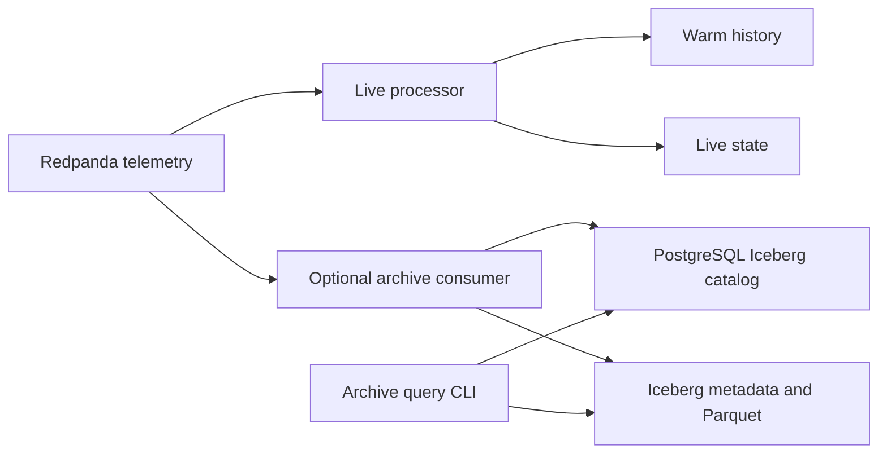

# Iceberg raw telemetry archive

The optional `iceberg` Compose profile adds a second Kafka consumer. It writes
Iceberg v2 tables through PyIceberg 0.12.0, using the existing PostgreSQL instance
as its SQL catalog. Zstandard-compressed Parquet, manifests, and table metadata
live in the persistent `iceberg` volume. The live processor, Redis, ClickHouse,
and QueryFlux paths continue independently.



## Start and inspect

After `make setup`, run:

```bash
make iceberg                 # builds optional image; starts required seed services
make iceberg-status          # records, snapshots, initial offsets and next offsets
make iceberg-integration     # isolated Kafka topic/table; restart and read verification
```

This does not start a simulator. Use the existing running demo or `make simulator`
to generate events. The first archive run begins at each partition's earliest
**retained** offset. It cannot recover events already removed by Kafka retention
or export old ClickHouse-only history. `start_offsets` records that coverage boundary.

Query a vehicle over a UTC interval (start inclusive, end exclusive):

```bash
docker compose --env-file .env -f infra/docker-compose.yml exec -T iceberg \
  python -m archive.cli query --vehicle-id V000001 \
  --start 2026-09-27T00:00:00Z --end 2026-10-01T00:00:00Z --limit 20
```

Add `--snapshot-id ID` using an ID from `make iceberg-status` to read an earlier
snapshot. Queries select valid telemetry, preserve UTC timestamps and nullable
energy fields, and return at most 1,000 records. Results have no guaranteed sort
order. The output limit bounds returned rows, not total scan work. This is an
operator CLI; the dashboard and QueryFlux have no archive route in this change.

```bash
make iceberg-down            # stops only the archive; data/catalog persist
make down                    # stops all profiles; preserves volumes
```

## Data and recovery contract

- The table is `valeosense.telemetry_archive`. It stores every canonical telemetry
  field plus exact `raw_payload` bytes, `valid`, `validation_error`, Kafka topic,
  partition, offset, and `received_at` (Kafka record timestamp, falling back to
  worker UTC time when unavailable). Daily partitions use `received_at`; late
  event timestamps remain intact and are queryable.
- Invalid JSON, schema failures, and tombstones are retained in the same table
  with `valid=false`. Error codes exclude input values. A sequence outside the
  Iceberg signed 64-bit range is retained as invalid. This does not change the
  live processor's rejection handling.
- Raw identity is `(topic, partition, offset)`. Two Kafka records carrying the
  same `event_id` both remain in the archive. Use ClickHouse's deduplicated views
  for the existing application semantics.
- Each commit atomically publishes data files and per-partition next-offset
  properties. Only then does the consumer acknowledge Kafka. If acknowledgement
  fails, restart reads Iceberg's checkpoint and skips already archived offsets.
  An uncertain commit stops the process; it never reuses an uncertain transaction.
- A PostgreSQL advisory lock permits one consumer per archive table. Concurrent
  commit retries are disabled so a conflict cannot silently rebase stale offsets.
  Do not write to this table with another writer, reset its checkpoint properties,
  or roll its current snapshot backward independently of the checkpoints.
- Recovery fails if a saved checkpoint is outside the broker's retained offset
  range. Investigate retention loss; do not silently reset to latest. Broker/topic
  recreation must use a new archive table, even if the topic name is reused.
- Batches cap at 5,000 records by default, flush within 10 seconds, and cap raw
  payload bytes at 32 MiB. One oversized record fails closed. Kafka's local queue
  is also capped. A successful heartbeat means the consumer is assigned and its
  latest flush/catalog check succeeded; it is not proof of zero archive lag.

The archive is independent of ClickHouse's 30-day TTL. There is no distributed
transaction with the live stores, no automatic backfill, and no guarantee of
complete archival if this consumer falls behind Kafka's retention. The local
warehouse and PostgreSQL catalog both need backups. Never delete just one of them.
There is no automatic archive TTL, compaction, snapshot expiration or orphan-file
cleanup. Data/files grow until an operator applies an appropriate maintenance
policy; failed writes may leave unreferenced files. These are still required for
a sustained production deployment.

## Configuration and development

| Variable | Default / purpose |
|---|---|
| `ICEBERG_CATALOG_URI` | `DATABASE_URL`, normalized to SQLAlchemy's psycopg 3 driver |
| `ICEBERG_WAREHOUSE` | `file:///data/iceberg/warehouse` in Compose |
| `ICEBERG_TABLE` | `valeosense.telemetry_archive` |
| `ICEBERG_TOPIC` | `valeosense.telemetry.v1` |
| `ICEBERG_BATCH_ROWS` | `5000`, allowed 1–10000 |
| `ICEBERG_FLUSH_SECONDS` | `10`, allowed 1–30 |

Host development requires the optional dependencies and a writable warehouse:

```bash
.venv/bin/python -m pip install -r requirements.lock -r requirements-iceberg.lock
make iceberg-test
ICEBERG_WAREHOUSE=file:///tmp/valeosense-iceberg \
ICEBERG_HEALTH_PATH=/tmp/valeosense-iceberg-health.json \
  .venv/bin/python -m archive.cli consume
```

Do not point a host worker at an existing Compose table whose files use container
paths. Use a separate `ICEBERG_TABLE`, or run all readers/writers inside Compose.
The PostgreSQL URI must point to the same catalog database for all participants.

PyArrow FileIO also accepts an `s3://bucket/prefix` warehouse. Configure the named
catalog with standard `PYICEBERG_CATALOG__VALEOSENSE_ARCHIVE__S3__*` environment
variables (endpoint, region, access key ID, secret access key), or its supported
credential chain. Keep credentials in the ignored `.env`, provision the bucket
first, and use a new table when changing warehouse locations. Existing tables
retain their original locations. S3/MinIO deployment is configurable but is not
validated by the local filesystem tests; no object-store service is bundled.

Upstream references: [PyIceberg SQL catalog and FileIO configuration](https://py.iceberg.apache.org/configuration/)
and [table transactions, writes, and snapshot reads](https://py.iceberg.apache.org/api/).

## Verification

`make iceberg-test` uses real temporary SQLite catalogs, Iceberg manifests and
Parquet files. It exercises replay, malformed records, nullable fields, daily
partitions, snapshot reads, failed catalog commits and failed Kafka acknowledgements.
`make iceberg-integration` uses real Kafka and PostgreSQL with a unique test topic
and table, starts the actual worker, rejects a second owner, restarts the worker,
and verifies stored raw bytes, offsets and old snapshots. It deletes only its own
test topic/table. Neither test is a throughput benchmark or an S3 qualification.
