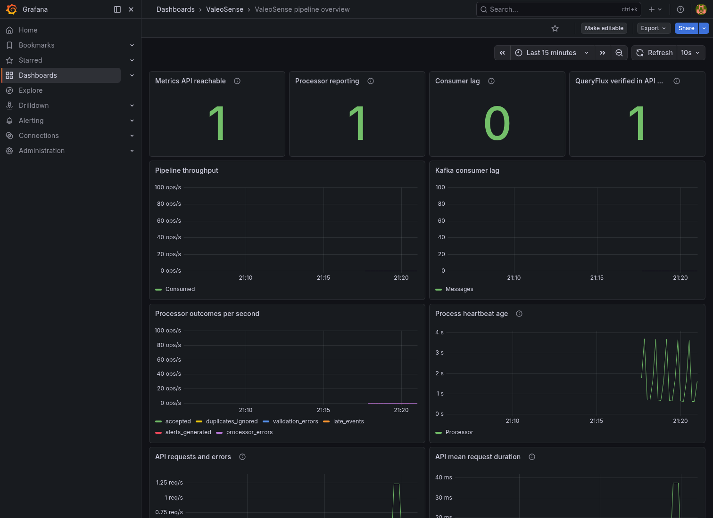
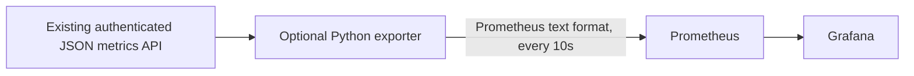

# Optional Grafana monitoring

Start the core application with `make up` (direct analytics) or `make up-queryflux`
(routed analytics), then run:

```bash
make monitoring
```

Open [Grafana](http://localhost:3001/d/valeosense-overview). Sign in as `admin` with
the local `API_KEY` from `.env`, or set `GRAFANA_ADMIN_PASSWORD` in `.env` before
the first start to use a separate password. Grafana retains its login in its
persistent database; changing the environment does not reset an existing account.
The provisioned **ValeoSense pipeline overview** dashboard and Prometheus data
source require no manual import or plugins.



`make monitoring` adds services to an already running application; it does not
recreate the backend or change its analytical route. To start everything from
scratch with live demo traffic and monitoring:

```bash
docker compose --env-file .env -f infra/docker-compose.yml \
  --profile demo --profile monitoring up --build -d
```

Monitoring is disabled by default. `make monitoring-down` stops only Grafana,
Prometheus and the exporter. `make down` includes all optional profiles and
preserves their volumes. Initial startup downloads the two monitoring images.

## Data flow and panels



The exporter calls `/api/v1/system/metrics` and `/api/v1/system/routing` using
`X-API-Key`. Its `/metrics` endpoint and Prometheus are internal to the Compose
network, with no published host ports. Grafana is bound to loopback port 3001.
The optional exporter uses the existing Python dependencies. No API credentials
are embedded in the dashboard or Prometheus configuration.

The dashboard covers API reachability, processor freshness, consumed/generated
rates, committed Kafka lag, accepted/duplicate/invalid/late events, incidents,
processor errors, API requests/errors and mean duration, analytical concurrency,
route attempt rates, and QueryFlux verification in the current API process.

- A report older than five seconds is marked as not reporting. Its operational
  counters, throughput and lag are omitted; unknown lag is never converted to zero.
- Heartbeat age remains available until Redis expires the report after 120 seconds.
- A failed upstream request returns HTTP 503 from the exporter, giving Prometheus
  `up=0`. No previous snapshot is served as a successful scrape.
- Counters reset when source processes restart. Rate panels use Prometheus `rate`
  and need at least two scrapes. A simulator must be running for its live panels.
- API duration is a mean, not p95/p99. It includes health and monitoring requests.
  Event latency is the processor's latest batch observation, not a percentile.
- QueryFlux configured and QueryFlux verified are separate signals. Direct mode
  legitimately reports verification as zero; a previous success is not an ongoing
  QueryFlux health probe.

Prometheus retains up to seven days or 512 MB of samples (whichever limit is
reached first; disk use also includes WAL/head overhead). Grafana settings and
Prometheus history live in named volumes. This adds local metrics visualization,
not distributed tracing, host/container exporters, or notification delivery.

## Verification and troubleshooting

```bash
make monitoring-test
# Optional browser check, using the existing local Chromium:
cd frontend && node scripts/monitoring-smoke.mjs && cd ..
docker compose --env-file .env -f infra/docker-compose.yml --profile monitoring ps
docker compose --env-file .env -f infra/docker-compose.yml exec prometheus \
  promtool check config /etc/prometheus/prometheus.yml
docker compose --env-file .env -f infra/docker-compose.yml exec prometheus \
  wget -qO- http://localhost:9090/api/v1/targets
```

If the target is down, check the backend and exporter logs. If the target is up
but the processor is not reporting, inspect the processor heartbeat, logs and
sink availability. Rising lag with fresh heartbeats indicates the consumer is
falling behind; compare consumed and generated rates. The dashboard alone does
not establish why a dependency is slow.

Configuration follows the upstream [Grafana provisioning guide](https://grafana.com/docs/grafana/latest/administration/provisioning/)
and [Prometheus configuration](https://prometheus.io/docs/prometheus/latest/configuration/configuration/)
and [text exposition format](https://prometheus.io/docs/instrumenting/exposition_formats/).
