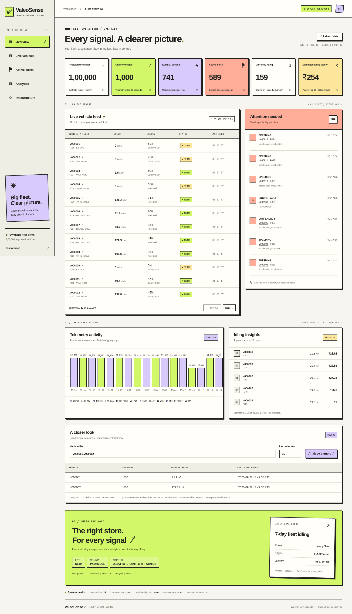
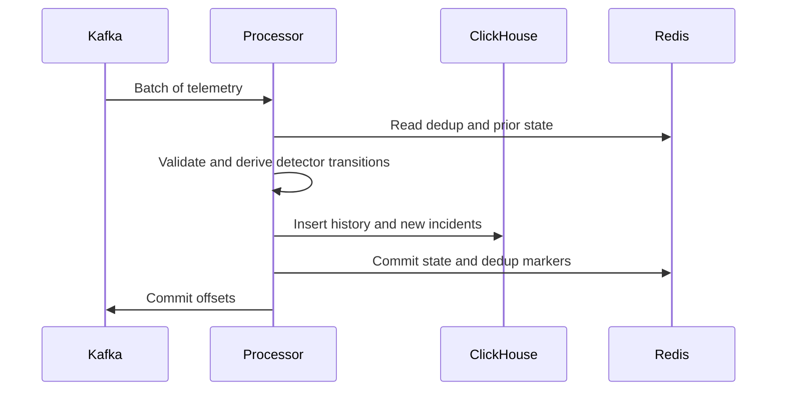

# ValeoSense — Connected Vehicle Intelligence

Submission narrative following the supplied solution template. Team name, member
roles/contact details, repository URL, submission date and final video URL must
be supplied by the team before PDF export. The original DOCX is unchanged.

## 1. Executive summary

ValeoSense helps a fleet manager inspect current vehicle conditions and historical
incidents through a working streaming prototype. A deterministic registry contains
100,000 synthetic vehicles. Stateful telemetry flows through Kafka-compatible
Redpanda into a Python processor, Redis live state and ClickHouse history;
PostgreSQL stores metadata. FastAPI serves a React dashboard, and existing
QueryFlux software routes analytical reads to ClickHouse and embedded DuckDB in the Compose demo; direct ClickHouse mode remains available. DuckDB reads a bounded recent Parquet sample refreshed from canonical ClickHouse.

The saved short benchmark sustained a 1K readings/sec generation target; the
10K target exceeded single-processor capacity. Optional Grafana/Prometheus
monitoring exposes operational signals. No 100K events/sec, production SLA,
customer savings or predictive-maintenance accuracy is claimed.

## 2. Problem Statement & Validation

### 2.1 Problem Statement

A fleet manager needs current state and historical incident context because
continuous telemetry and historical scans have different storage/access needs.
The prototype evaluates workload separation; it does not establish that every
relational implementation is unsuitable. Drivers and operations teams are
secondary stakeholders; no real driver data is collected.

### 2.2 Evidence & Validation

| Evidence or assumption | Method | Result / confidence |
|---|---|---|
| 100K unique vehicle registry | Seeded generation and tests | Verified synthetic registry |
| Replay/dedup behavior | Real Kafka/API integration and sink-replay tests | Verified for tested failure paths |
| Capacity limit | Two 15-second load stages | 1K target stable; 10K unstable; limited-duration evidence |
| Fuel cost | 0.8 L/h, INR 100/L for ICE | Explicit assumption, no customer validation |
| Business impact | No interviews or field study | Unvalidated; no measured savings |

### 2.3 Impact & Success Metrics

Success criteria are functioning stateful telemetry, correct tested detectors,
bounded queues, independent live/analytical access and honest performance evidence.
At 100K registered vehicles, only the configured active subset emits readings.
Fleet size alone does not determine throughput or monetary impact. Existing OEM
portals and telematics products were not benchmarked; no competitive superiority
claim is made.

## 3. Solution Description

### 3.1 Solution Overview & User Journey

Start the stack and simulator, authenticate to the dashboard, inspect live vehicles
and active alerts, open a vehicle's history, then inspect idling estimates and
analytical routing. An incident provides context for operator investigation;
the system does not remotely control a vehicle.



### 3.2 Key Value Proposition

Fleet operators can inspect current incidents and recent history without making
live-state requests wait in the analytical queue. Estimated idle fuel cost is an
explicit assumption to support investigation, not a demonstrated saving.

### 3.3 Innovative Ideas

The implementation combines three practical techniques: live/history separation,
deterministic replay keys with deduplicated analytical views, and explicit route
evidence. These are established engineering techniques, not novel research claims.

## 4. Feature list

Video timestamps below remain pending until the team records the demo.

| Feature | Priority / status | Code | Video |
|---|---|---|---|
| 100K synthetic registry and twelve scenarios | Must / Done | `simulator/`, `scripts/generate_vehicles.py` | Pending |
| Idling, speeding, braking, acceleration and DTC detectors | Must / Done | `processor/detectors.py` | Pending |
| Dedup, late-event handling and bounded batches | Must / Done | `processor/pipeline.py` | Pending |
| Authenticated live/history APIs | Must / Done | `backend/main.py` | Pending |
| Fleet dashboard and vehicle history | Must / Done | `frontend/src/main.jsx` | Pending |
| Optional existing QueryFlux route | Should / Done | `backend/queryflux/`, `infra/queryflux.yaml` | Pending |
| Optional Grafana dashboard | Could / Done | `backend/monitoring.py`, `infra/monitoring/` | Pending |
| Multi-tenant identity and cold archive | Won't in prototype / Planned | No implementation | Not applicable |

## 5. Solution Architecture

### 5.1 Architecture Overview

The fleet manager uses React over HTTP; FastAPI authenticates API requests and
reads Redis/PostgreSQL directly. Analytical templates use either ClickHouse HTTP
or QueryFlux Trino HTTP. A simulator publishes JSON over Kafka protocol; the
processor writes ClickHouse batches and Redis state before committing offsets.
See the [architecture diagram](architecture.mmd) and [ER diagram](er-diagram.mmd).
Per-hop latency distributions have not been measured.

### 5.2 Technology Stack & Justification

Kafka provides replay and buffering; Redis supports bounded live reads;
PostgreSQL enforces fleet/vehicle relationships; ClickHouse serves history. Python
and Compose keep this prototype operable on one machine. Embedded DuckDB serves small sample queries through an explicit QueryFlux namespace rule. Flink and Kubernetes remain outside the scope.

### 5.3 Data Architecture

Metadata separates fleets and vehicles but deliberately repeats OEM/model values;
full catalog normalization is deferred. Historical rows denormalize fleet and
vehicle attributes for analytical access. Redis is transient state, not an archive.
Live state expires after one hour, dedup after 24 hours, and ClickHouse history
after 30 days. Cold retention is not implemented. No formal multi-node CAP or
availability claim is established by this single-node deployment.

For capacity planning only, **assuming** 1 KB/event, 1K events/sec produces roughly
86.4 GB/day or 31.5 TB/year before compression, replicas and indexes; 100K/sec
would multiply this by 100. These are arithmetic estimates, not measured disk use.
ClickHouse partitions monthly and orders telemetry by vehicle/time/event ID.
The [measured lookup optimization](sql-optimization.md) reduced rows read from
515,271 to 4,096, with median execution 23.693 ms to 2.402 ms. Only one before/after
query comparison is recorded; three-query optimization evidence is incomplete.

### 5.4 Deployment View

Deployment is local Docker Compose with one broker, one processor and one replica
per data service. Published ports bind to loopback. Credentials come from ignored
local configuration. The root Compose demo includes both analytical engines and automatic sample initialization. The underlying `queryflux` profile remains optional for direct mode; `monitoring` is always optional. No cloud portability trial, autoscaling or failover deployment was performed.

## 6. Low-Level Design

### 6.1 Layering & Separation of Concerns

`simulator/` owns stateful generation and producer pacing; `processor/` owns
validation, detectors and sink sequencing; `shared/` provides canonical models,
settings and SQL adapters; `backend/` provides HTTP templates and analytical
admission; `frontend/` owns presentation. `tests/unit/` uses explicit test doubles;
`tests/integration/` uses real services. `infra/` holds schemas and deployment;
`scripts/` holds setup, seed, benchmark and verification commands.

### 6.2 Design Principles Applied

This is a pragmatic layered prototype, not strict hexagonal architecture: SQL
templates remain in API handlers and processors know sink adapters. Detectors
are independently testable. Environment configuration, bounded queues, explicit
failures and narrow adapters keep responsibilities understandable.

### 6.3 Design Patterns Used

Storage adapters in `shared/storage.py` isolate client operations.
`backend/analytics.py` selects one explicit route and applies a semaphore to
bound analytical concurrency. Deterministic event keys plus dedup implement
practical replay protection. No distributed saga or transactional outbox is claimed.

### 6.4 Interfaces, Contracts & Runtime Flows

Telemetry uses JSON with Pydantic validation and vehicle IDs as Kafka keys on
`valeosense.telemetry.v1`. The v1 API provides bounded pagination and a consistent
`error` envelope. OpenAPI is at `/docs`; arbitrary SQL is not exposed. General
request rate limiting and a schema registry are not implemented. Analytical
admission allows four running and sixteen waiting requests.



```mermaid
sequenceDiagram
  participant K as Kafka
  participant P as Processor
  participant C as ClickHouse
  participant R as Redis
  P->>C: History insert succeeds
  P->>R: State write fails
  Note over P,K: Offsets withheld; worker exits and restarts
  K->>P: Replay uncommitted batch
  P->>C: Reinsert deterministic event keys
  Note over C: FINAL read view collapses duplicate rows
  P->>R: State write succeeds
  P->>K: Commit offsets
```

### 6.5 Algorithms & Data Structures

Per event: validate, skip duplicate, retain late history without changing live
state, calculate transitions from prior reading, then queue sink writes. Hash
lookups and scalar detectors take expected O(1) time per event. Batch working
space is O(batch), active state O(active vehicles), and retained dedup markers
O(rate × TTL). Redis sorted-set updates are O(log N). Exactly-once transactions
across sinks are not implemented.

## 7. Non-functional requirements and benchmarks

| Target | Evidence / status |
|---|---|
| 100K+ events/sec | Not achieved; higher targets stopped after 10K saturation |
| Stable 1K generation target | 999.87/sec; full-path startup/drain-inclusive consumption 923.99/sec |
| 10K generation target | 9,997.86/sec generation, 24.53-second drain; unstable |
| Dashboard under 2s / critical alert under 5s | Not established; dashboard polls every 3s |
| API p95 <200ms / p99 <500ms | Percentile benchmark not performed |
| Replay recovery | Tested sink failure/replay; no full chaos campaign |
| 99.9% availability / no single point of failure | Not provided by this single-machine stack |

The saved test host reports eight logical CPUs and approximately 8 GB RAM.
See [benchmark evidence](benchmark.md) and [verification](verification.md).
The latest benchmark ran with optional monitoring enabled and no concurrent demo simulator.
These 15-second stages do not establish long-duration sustained capacity.

## 8. Security and compliance

The [threat model](threat-model.md) covers unauthenticated access, SQL injection,
forged telemetry, secret disclosure and resource exhaustion. Controls include
API-key checks, validated identifiers, parameterized metadata queries, fixed
analytical templates, pagination and concurrency bounds, and loopback ports.
Grafana requires login; its datasource/exporter ports are internal.

OIDC, RBAC, tenant isolation, device identity, service authentication and TLS are
not implemented. All vehicle records and locations are synthetic. No GDPR/DPDP
compliance certification, real-person processing assessment or security audit is
claimed. Warm TTL is deletion, not archival or a complete erasure workflow.

## 9. Test strategy

The latest unit/API/exporter/benchmark tests and the real Kafka integration result
are recorded in [verification.md](verification.md). Tests cover stateful scenarios,
validation, detector continuity, dedup, late events, sink failure, route pagination
trust, and missing/stale monitoring values. Real browser and monitoring checks are
separate commands. CI runs lint, unit tests and frontend build; it does not run
the Compose integration, load, browser or security suites. Line/branch coverage,
SAST/DAST and image vulnerability reports have not been collected.

## 10. Observability

JSON APIs expose counters, rate, heartbeat, committed lag and analytical routing.
The optional [Grafana integration](monitoring.md) retains metrics with Prometheus.
During a slowdown, first inspect freshness and scrape availability, then compare
producer/consumer rates and lag, then inspect processor/sink logs and API errors.
Counters are process-local; mean API duration and latest-batch latency are not
percentiles. Distributed tracing and outbound alert notifications are deferred.

## 11. AI / ML Component

No ML model is required for the current solution.

No runtime ML model or LLM agent is used. Explicit physical thresholds and episode
state implement detection. Codex assisted development; it is not part of the
vehicle processing path.

## 12. Decisions, risks and next steps

[ADRs](adr) document messaging, live state, workload separation, external QueryFlux
and retention/scope. Major risks are single ownership, cross-sink recovery gaps,
finite broker retention and Redis dedup memory. Next steps: partition-owned workers
with stronger replay checkpoints; authenticated tenant boundaries; durable rejected
events and Parquet archival before expanding analytical integrations.

## 13. Demo video

Video URL and actual feature timestamps: **pending team recording**.
The [five-minute script](demo-script.md) includes the working dashboard, route,
failure demonstration and measured capacity limits. A video has not been uploaded.

## 14. Repository checklist

README, `.env.example`, Compose, service folders, tests, diagrams, ADRs and locked
dependencies are present. `make demo` starts the application with a simulator.
CI covers unit/lint/build only. No submission tag or publication was created in
this continuation. Team contribution metadata and final PDF/video remain team tasks.

## 15. Conclusion

The prototype demonstrates the complete synthetic event-to-dashboard path and
exposes its measured limits. Replay behavior, timestamp handling and observed
processor saturation were addressed or documented with reproducible evidence.
Pilot readiness still requires stronger recovery, security and capacity work.

## 16. Declarations

QueryFlux is an existing external project. Component licenses and Codex usage
are declared in [open-source.md](open-source.md). Data is synthetic and contains
no real customer/driver records. Screenshots come from actual browser runs;
benchmark and validation gaps are explicitly identified.

## 17. Appendix

[Setup and API guide](../README.md), [architecture](architecture.md),
[verification](verification.md), [benchmark raw data](../benchmark_results.json),
[SQL evidence](../artifacts/sql-optimization.json), and [failure demo](failure-demo.md).
